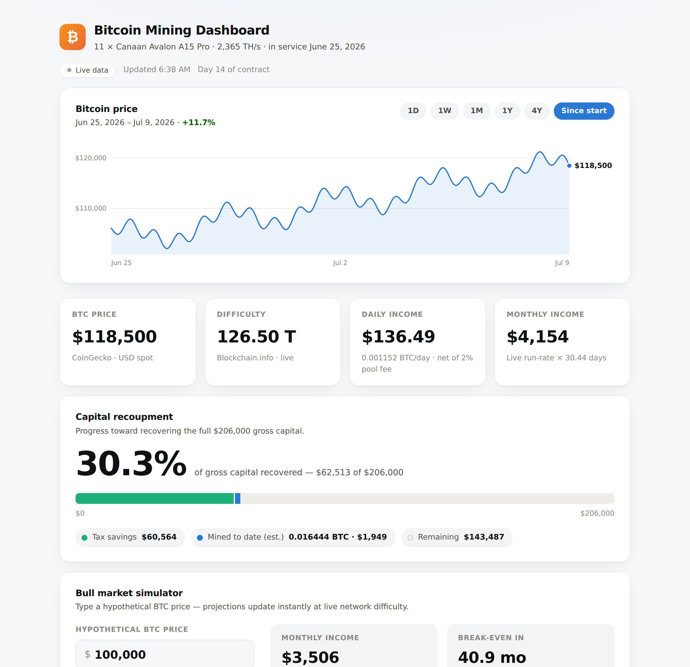

# Bitcoin Mining Dashboard

A single-file, zero-dependency dashboard for tracking a Bitcoin mining contract in real
time — live price and difficulty, estimated yield, capital recoupment progress, a price
history chart, a bull-market simulator, and optional read-only wallet tracking.

Everything lives in one `index.html`: no build step, no framework, no npm install.
Download it, open it in a browser, and it works.


*Sample data shown. The dashboard fetches live prices and difficulty at runtime.*

## Features

- **Live KPIs** — BTC price (CoinGecko) and network difficulty (Blockchain.info),
  auto-refreshed every 60 seconds, with estimated daily and monthly income net of your
  pool fee. If an API is unreachable, the dashboard falls back to clearly flagged
  estimates instead of breaking.
- **Price history chart** — hand-rolled SVG, no chart library. Defaults to "since your
  contract started" and zooms from 1 day to 4 years, with a hover crosshair showing the
  exact price and date.
- **Capital recoupment bar** — visualizes progress toward recovering your gross capital:
  a fixed block for Year-1 tax savings stacked with income accrued since your start date.
- **Bull market simulator** — type any hypothetical BTC price and instantly see projected
  monthly income and months remaining to break even.
- **Wallet tracking (optional)** — paste your pool's payout address to see the actual BTC
  received on-chain alongside the estimate. Read-only: an address can never spend funds.
- **Fully configurable** — every contract parameter is editable in the UI and saved in
  your browser only, so the repo never contains anyone's personal numbers.
- **Light & dark mode** — follows your system theme, with colorblind-safe chart colors.

## Quick start

1. **Get the file** — clone the repo or just download `index.html`:

   ```sh
   git clone https://github.com/Krishtof-Korda/bitcoin-mining-dashboard.git
   ```

2. **Open `index.html` in any modern browser.** That's it — no server, no install.
   Live data starts loading immediately.

3. **Enter your contract** — expand **Contract details & methodology** at the bottom.
   Values with a dashed underline are editable: gross capital, tax assumptions, start
   date, machine count and hashrate, pool fee, block reward. Every figure on the page
   recalculates as you type.

Your edits are stored in the browser's `localStorage` — they survive reloads on your
machine and are never written back to the file or the repo. **Reset to defaults**
clears them.

### Optional: track your actual payouts

In the same details panel, under **Wallet tracking**, paste the payout address your
mining pool sends rewards to (the address in your *pool's payout settings* — not a fresh
receive address from your wallet, which rotates). The dashboard then shows actual BTC
received on-chain next to the theoretical estimate.

Note: pool earnings accumulate off-chain until the pool sends a payout, so the on-chain
number lags the estimate until your first payout lands.

### Optional: host it with GitHub Pages

Fork this repo, then in your fork: **Settings → Pages → Deploy from a branch →**
`main` **/ (root)**. Your dashboard will be live at
`https://<your-username>.github.io/bitcoin-mining-dashboard/` — and because your
numbers live in localStorage, the hosted page stays generic for everyone else.

## How the math works

Estimated daily yield uses the standard network-share formula:

```
dailyBTC = fleetTH/s × 10¹² × 86,400 s × blockReward
           ─────────────────────────────────────────  × (1 − poolFee)
                     difficulty × 2³²
```

Monthly income is the daily run-rate × 30.44 (average days per month). Year-1 tax
savings = gross capital × depreciation % × tax bracket %. The recoupment bar measures
(tax savings + income to date) against gross capital.

These are **estimates**: actual pool payouts vary with luck, fee structures, and
difficulty adjustments (roughly every two weeks). Nothing here is financial or tax advice.

## Data sources

| Data | Source | Cadence |
|---|---|---|
| BTC spot price | [CoinGecko](https://www.coingecko.com) simple price API | every 60 s |
| Network difficulty | [Blockchain.info](https://blockchain.info) query API | every 60 s |
| Price history ≤ 1 year | CoinGecko market chart API | 5 min cache per range |
| Price history > 1 year | Blockchain.info charts API | 5 min cache per range |
| On-chain wallet totals | Blockchain.info, falling back to [mempool.space](https://mempool.space) | every 60 s |

All endpoints are public, free, keyless, and called read-only from your browser. If your
ad-blocker blocks one, the dashboard degrades gracefully and says so.

## Privacy & security

- **Nothing personal ships in this repo.** Contract parameters and wallet addresses are
  entered in the UI and stored in your browser's localStorage only.
- **Wallet tracking is read-only by cryptography.** A Bitcoin address can be watched but
  never spent from. Still, avoid committing addresses or xpubs anywhere public — they
  permanently link your identity to your balance.
- The page makes no requests other than the data APIs above, and stores nothing anywhere
  but your own browser.

## Development

The entire app is `index.html` — HTML, CSS, and JavaScript in one file, by design.
To modify it, edit the file and refresh your browser.

To verify changes without relying on live APIs, drive the page in headless Chromium and
mock the endpoints (see `CLAUDE.md` for the testing recipe used to build this project).

Contributions are welcome — keep PRs small and focused on one concern.
