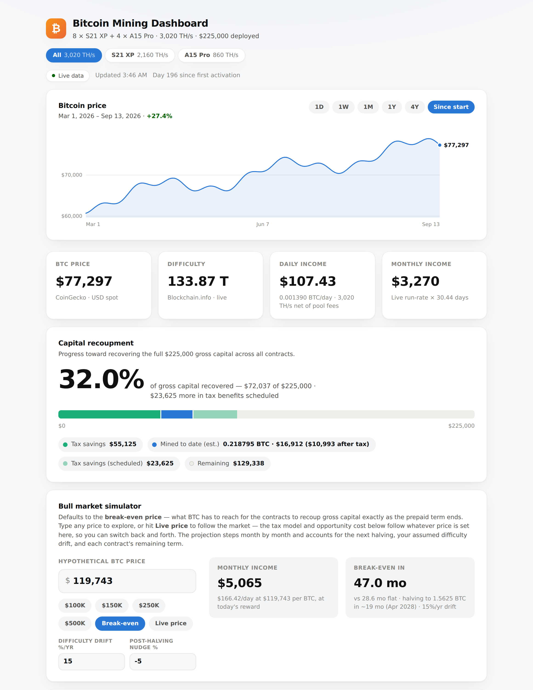

# Bitcoin Mining Dashboard

A single-file, zero-dependency dashboard for tracking one or more Bitcoin mining contracts in
real time — live price and difficulty, capital recoupment, a price history chart, an after-tax
multi-year model, an opportunity-cost comparison, and optional read-only wallet tracking.

Everything lives in one `index.html`: no build step, no framework, no npm install.
Download it, open it in a browser, and it works.


*Illustrative contract values — not anyone’s real terms. The dashboard fetches live prices
and difficulty at runtime; your own figures stay in your browser.*

## Features

- **Multiple contracts** — run several hardware deals side by side, each with its own rigs,
  hashrate, capital, prepaid power, pool fee, tax rates and start date. Pills at the top switch
  between **All** and any individual contract, and the whole page re-renders for the selection.
  Income is computed per contract and summed, never blended, so staggered start dates stay correct.
- **Live KPIs** — BTC price (CoinGecko) and network difficulty (Blockchain.info), refreshed every
  60 seconds, with estimated daily and monthly income net of your pool fee. If an API is
  unreachable the dashboard falls back to clearly flagged estimates instead of breaking.
- **Price history chart** — hand-rolled SVG, no chart library. Defaults to "since your contract
  started" and zooms from 1 day to 4 years, with a hover crosshair showing the exact price and date.
- **Capital recoupment bar** — progress toward recovering gross capital, split into tax savings
  already earned, mining income to date (with the after-tax figure alongside), and tax benefits
  **scheduled** but not yet realised. Later-year deductions move from scheduled to earned
  automatically as each contract year closes, so the headline percentage only ever reflects money
  actually recovered.
- **Bull market simulator** — opens at the **break-even price**: what BTC must reach for the
  contracts to recoup gross capital exactly as the prepaid term ends. Type any price, hit
  **Break-even** to snap back, or **Live price** to follow the market. The projection steps month
  by month and accounts for the next halving, an assumed difficulty drift, and each contract's
  remaining term — so it flags when a contract will not break even before hosting runs out.
- **After-tax & multi-year tax model** — mined BTC is ordinary income when mined, but depreciation
  and energy deductions can shelter it, so recoupment counts mining income pre-tax with the
  after-tax figure shown as a conservative reference. A 48-month ledger breaks out deductions, tax
  benefit, mining income, mining tax and after-tax mining for each contract year.
- **Opportunity cost & return** — compares the contracts against simply investing the same capital
  at a benchmark rate, using the full 48-month cash flow. Reports the benchmark's future value,
  mining proceeds reinvested at the same rate, **NPV** and **IRR** — so you can see whether the
  deal actually beat the alternative, not just whether it returned your money.
- **Scenario-driven analysis** — the tax model and opportunity cost follow whatever price is set in
  the simulator, so you can watch the whole return profile scale with a bull run. The KPI row and
  recoupment bar stay pinned to live data, so the headline figure is never hypothetical.
- **Wallet tracking (optional)** — paste your pool's payout address to see actual BTC received
  on-chain alongside the estimate. Read-only: an address can be watched but never spent from.
- **Fully configurable** — every contract and model parameter is editable in the UI and saved in
  your browser only, so the repo never contains anyone's personal numbers.
- **Light & dark mode** — follows your system theme, with colorblind-safe chart colors.

## Quick start

1. **Get the file** — clone the repo or just download `index.html`:

   ```sh
   git clone https://github.com/Krishtof-Korda/bitcoin-mining-dashboard.git
   ```

2. **Open `index.html` in any modern browser.** That's it — no server, no install.
   Live data starts loading immediately.

3. **Enter your contract** — pick a single contract in the pills at the top, then expand
   **Contract details & methodology** at the bottom. Values with a dashed underline are editable:

   | Where | What you can set |
   |---|---|
   | Per contract | miner model, machine count, TH/s per machine, pool fee, gross capital, prepaid power, depreciation %, tax bracket %, mining income tax %, years 2–4 deductions, in-service date, contract term |
   | Network | block reward (halves ~2028) |
   | Simulator | hypothetical BTC price, difficulty drift %/yr, post-halving nudge % |
   | Opportunity cost | benchmark return %/yr |

   Every figure on the page recalculates as you type. Select **All** to see every contract side by
   side with fleet totals.

Your edits are stored in the browser's `localStorage` — they survive reloads on your machine and
are never written back to the file or the repo. **Reset all contracts to defaults** clears them.

### Optional: track your actual payouts

In the same details panel, under **Wallet tracking**, paste the payout address your mining pool
sends rewards to (the address in your *pool's payout settings* — not a fresh receive address from
your wallet, which rotates). The dashboard then shows actual BTC received on-chain next to the
theoretical estimate.

Note: pool earnings accumulate off-chain until the pool sends a payout, so the on-chain number lags
the estimate until your first payout lands.

### Optional: host it with GitHub Pages

Fork this repo, then in your fork: **Settings → Pages → Deploy from a branch →** `main` **/ (root)**.
Your dashboard will be live at `https://<your-username>.github.io/bitcoin-mining-dashboard/` — and
because your numbers live in localStorage, the hosted page stays generic for everyone else.

## How the math works

**Daily yield** uses the standard network-share formula, per contract:

```
dailyBTC = fleetTH/s × 10¹² × 86,400 s × blockReward
           ─────────────────────────────────────────  × (1 − poolFee)
                     difficulty × 2³²
```

Monthly income is the daily run-rate × 30.44 (average days per month).

**Forward projections** step month by month rather than extrapolating a flat rate. Each month
applies the block reward in effect then (halving every 210,000 blocks — the date is derived from
the live block height at ~10 min/block), compounds your assumed difficulty drift, and drops a
contract's income once its prepaid term ends. If payback lands past the term, the months shown
assume mining continues and the shortfall at term end is reported alongside.

**Break-even price** is solved in closed form, not by searching: mining income scales linearly with
price while tax benefits do not, so the answer is `(gross capital − fixed inflows) ÷ income per
dollar of price` over the remaining term.

**Tax treatment.** Year-1 tax savings = gross capital × depreciation % × tax bracket %, treated as
banked up front. Years 2–4 deductions convert from scheduled to earned as each contract year
closes. Mined BTC is ordinary income at its value when mined; recoupment counts it pre-tax
(deductions can shelter it) with the after-tax figure shown as a conservative reference.

**Opportunity cost** builds the full cash-flow series — capital out at each contract's start,
mining income monthly, each year's tax benefit as that year closes — then discounts it at your
benchmark rate for NPV and solves for IRR by bisection. In a scenario, months already past stay
valued at the live price; only future months take the simulator price.

These are **estimates**: actual pool payouts vary with luck, fee structures, and difficulty
adjustments (roughly every two weeks). Nothing here is financial or tax advice.

## Data sources

| Data | Source | Cadence |
|---|---|---|
| BTC spot price | [CoinGecko](https://www.coingecko.com) simple price API | every 60 s |
| Network difficulty | [Blockchain.info](https://blockchain.info) query API | every 60 s |
| Block height (halving date) | Blockchain.info query API | every 60 s |
| Price history ≤ 1 year | CoinGecko market chart API | 5 min cache per range |
| Price history > 1 year | Blockchain.info charts API | 5 min cache per range |
| On-chain wallet totals | Blockchain.info, falling back to [mempool.space](https://mempool.space) | every 60 s |

All endpoints are public, free, keyless, and called read-only from your browser. If your ad-blocker
blocks one, the dashboard degrades gracefully and says so.

## Privacy & security

- **Nothing personal ships in this repo.** Contract parameters and wallet addresses are entered in
  the UI and stored in your browser's localStorage only.
- **Wallet tracking is read-only by cryptography.** A Bitcoin address can be watched but never spent
  from. Still, avoid committing addresses or xpubs anywhere public — they permanently link your
  identity to your balance.
- The page makes no requests other than the data APIs above, and stores nothing anywhere but your
  own browser.

## Development

The entire app is `index.html` — HTML, CSS, and JavaScript in one file, by design.
To modify it, edit the file and refresh your browser.

To verify changes without relying on live APIs, drive the page in headless Chromium and mock the
endpoints (see `CLAUDE.md` for the testing recipe used to build this project).

Contributions are welcome — keep PRs small and focused on one concern.
